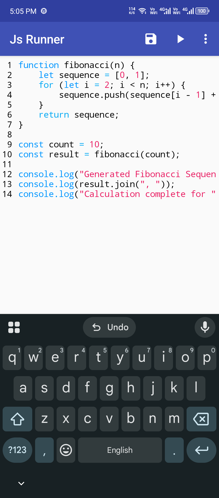
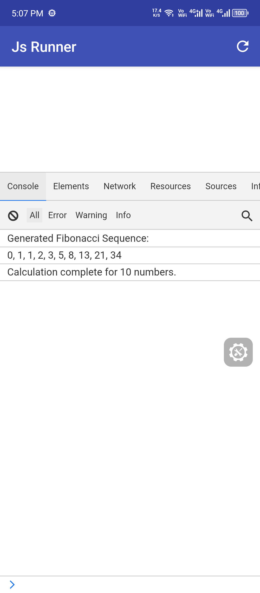

<p align="center">
  <h1 align="center">Js-Runner</h1>
</p>

<p align="center">
  
  
  
  
</p>

Simple JavaScript runner based on Android WebView and eruda.js

## Screenshots

### Main Screen


### Output Screen


## Features

- Run JavaScript code directly on Android
- Built-in console using eruda.js
- Simple and clean interface
- Support for modern JavaScript features

## Requirements

- Android 5.0 (API 21) or higher
- Android Studio

## Build

```bash
./gradlew assembleDebug
```

## Install

```bash
./gradlew installDebug
```

## Contributing

Contributions are welcome
